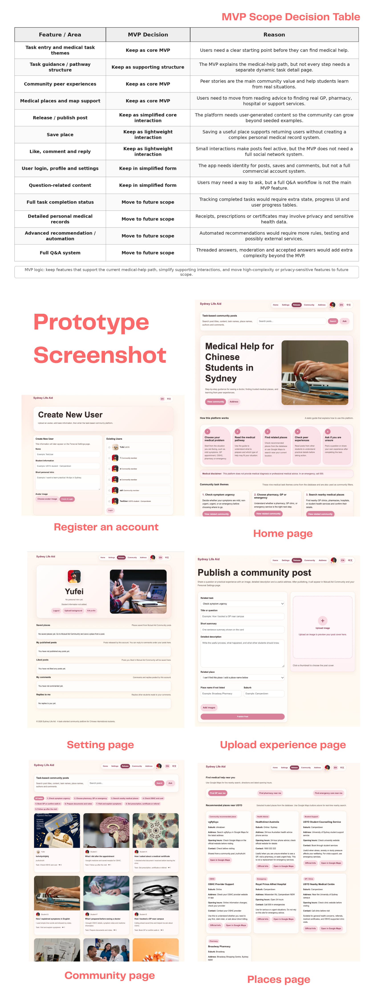
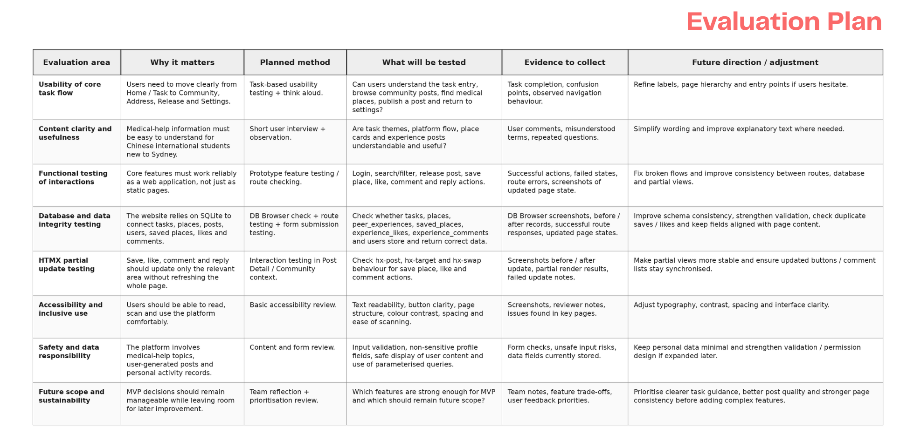

### Part 1: Multi-dimensional Evaluation

Week 11 focused on evaluating a prototype through mechanical correctness, user effectiveness, and analytics ethics. This means we need to check whether routes, database connections, HTMX updates, and page functions are stable, while also using Think Aloud, task-based testing, and accessibility testing to find real user problems. If user data is collected in the future, it should have a clear purpose and avoid unnecessary privacy risks. This helped me realise that finishing a prototype does not mean the design is complete. Testing checks whether the system truly supports users in completing their tasks.

### Part 2: Final Feature Decisions and Implementation

In the final MVP, we moved automatic recommendations, complex notifications, and multilingual translation into future scope. To avoid the website feeling like separate pages joined together, we unified cards, buttons, border radius, colours, page width, and responsive layout. The soft skin-tone palette and rounded design were used to make the platform feel warmer and more approachable. We also reorganised partial view names and reuse, so the final prototype felt more consistent.

### Part 3: Evaluation Plan and Testing Scope

Our testing plan was worked backwards from the real user path. It evaluates whether users can log in, browse tasks, filter experiences, find places, publish content, save, like, comment, and reply. The testing scope includes usability, content clarity, functional testing, database integrity, HTMX partial updates, accessibility, and safety.

The platform also needs a medical disclaimer and emergency guidance. It should avoid collecting unnecessary sensitive information, encourage display names, and reduce SQL injection, XSS, and privacy risks through validation, sanitisation, and parameterised queries.

### Part 4: Classroom Testing Feedback and Next Changes

During classroom testing, we invited members from another group to complete Think Aloud Testing, and our tutor also tested the main functions. Overall, the feedback showed that the website direction, content, and logic were clear. Users could understand that the platform helps Chinese international students in Sydney find medical help and read peer experiences.

However, testing also revealed several high-priority issues. First, the login / create user page felt too complicated because it asked for too much information. We plan to simplify it and keep only the information needed for the MVP. Second, the navigation bar did not have a clear active state, so users could not easily tell which page they were on. We will add a current page indicator. Third, the search function was too strict. If users enter a longer sentence containing a keyword, the system should still return related posts. After fixing these issues, we will continue testing and improving the prototype.

### Design Decisions

1. We made final feature decisions around the core user path.

2. We used classroom testing and the Evaluation Plan to guide improvements, while continuing to check functional testing, database consistency, HTMX partial updates, accessibility, and safety.

### Personal Reflection

Testing and analysis helped us make the project closer to real user needs. Before this, I focused more on whether the pages were finished and whether the functions worked. However, Week 11 helped me realise that running code does not mean users can use the system smoothly. Problems such as the login form, navigation state, and search logic only became clear when other people tested the prototype. A good prototype is not about having more features. It needs a clear core path, clear system feedback, and responsibility for user safety and privacy.

These decisions were discussed and finalised together. The testing plan, classroom testing, and revision direction were completed collaboratively.